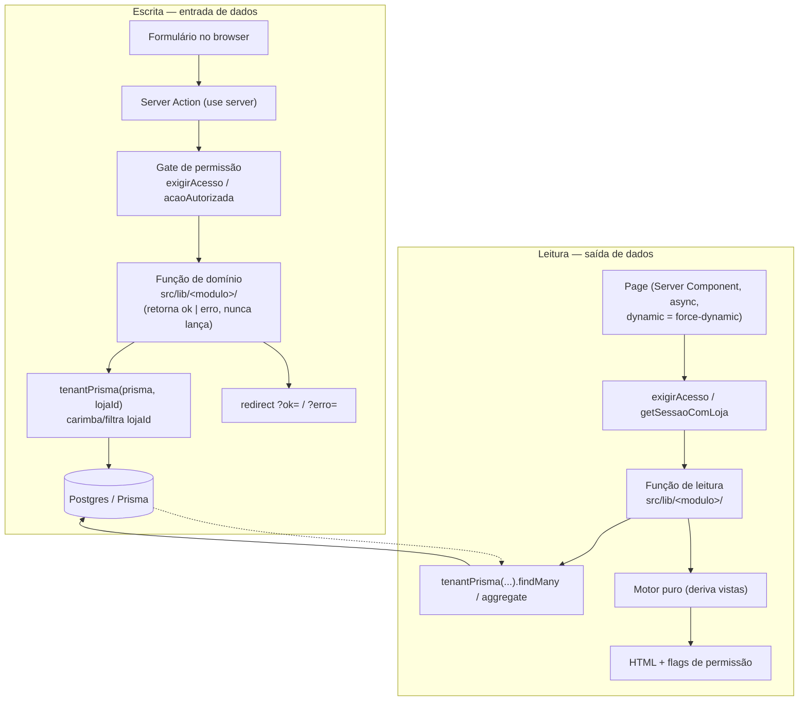
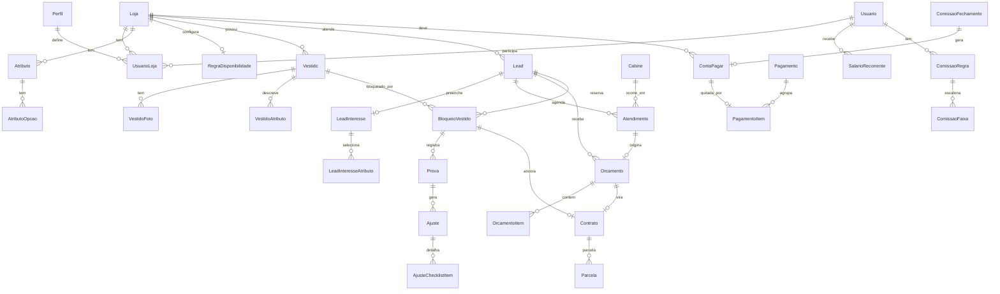
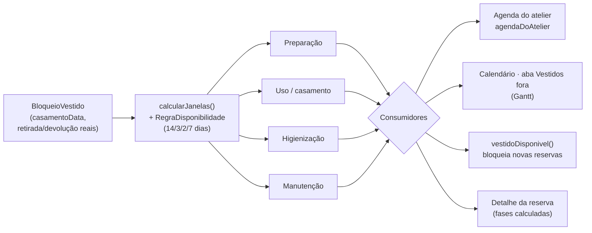
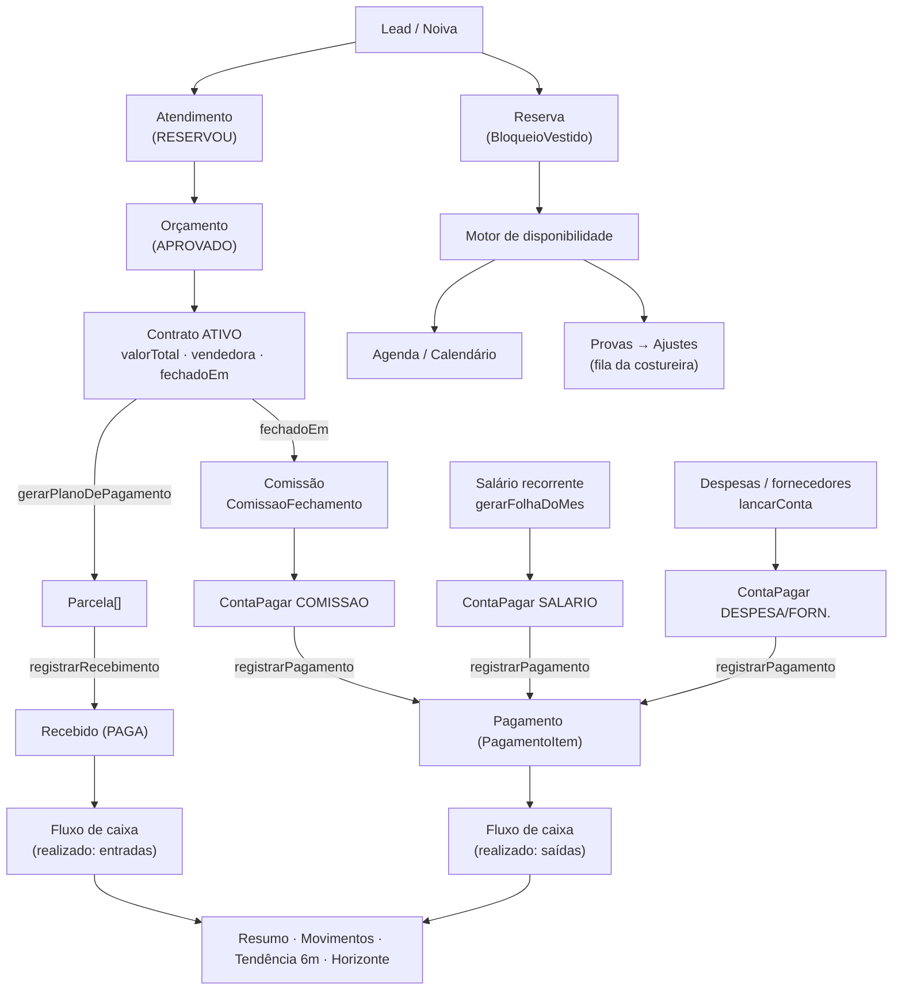

# Fluxo de dados — Moscow Noivas

> Mapa de **entrada → armazenamento → transformação → saída** dos dados do app.
> Gerado em 2026-06-05. Mantenha junto das mudanças estruturais.

O app é um **Next.js 16 (App Router) com Server Components + Server Actions e Prisma**,
multi-tenant por loja. Este documento descreve por onde o dado entra, onde vive, como é
transformado e por onde sai.

---

## 0. Modelo mental do fluxo

Todo dado atravessa as mesmas camadas, em dois sentidos.

Três invariantes atravessam tudo:

- **Tenant guard automático** (`src/lib/tenant.ts`): toda operação em um dos ~22 models com
  `lojaId` recebe `where: { lojaId }` no read e `data: { lojaId }` no create; no update o
  `lojaId` é **removido** do `data` (impede re-tenant). Falha fechada: dado de outra loja vira
  `null`/`[]`/no-op. Filhas puras (`VestidoFoto`, `AjusteChecklistItem`, `LeadInteresse*`,
  `AtributoOpcao`) não têm `lojaId` — são alcançadas só pelo pai já escopado. Exceção
  consciente: `UsuarioLoja` é lido cross-loja (responde "que lojas esse usuário vê?", antes de
  existir loja ativa).
- **Datas** viajam como `"YYYY-MM-DD"` na borda e vivem à **meia-noite UTC** no banco
  (`src/lib/tempo.ts`), evitando off-by-one de fuso. Competência é `"YYYY-MM"`.
- **Dinheiro** é **centavos inteiros** em trânsito (`src/lib/dinheiro.ts`), `Decimal(10,2)` no
  banco, `brl()` só na exibição.

---

## 1. Entradas (onde o dado nasce)

### Autenticação / contexto
- **Login** (`(public)/login/actions.ts`) → cria `Sessao` + cookie `moscow_sessao` (httpOnly, TTL 8h).
- **Selecionar loja** (`(public)/selecionar-loja/actions.ts`) → grava `Sessao.lojaAtivaId`
  (valida vínculo `UsuarioLoja` ou super-admin).
- `(app)/layout.tsx` faz o gate: sem sessão → /login; sem loja → /selecionar-loja.

### Jornada comercial (o coração)
| Entidade | Onde entra | Função de domínio |
|---|---|---|
| **Lead/Noiva** | `/noivas/nova` | `criarLead` (`leads.ts`) — nome, casamento, origem |
| **Interesse** | perfil da noiva | `LeadInteresse` + `LeadInteresseAtributo` (catálogo) |
| **Atendimento** | `/atendimentos/novo` | `agendarAtendimento` (cabine+vendedora+hora, valida slot livre) |
| **Orçamento** | pós-atendimento ou manual | `criarOrcamento` + `adicionarItem`/`definirDesconto` |
| **Contrato** | de orçamento APROVADO | `criarContratoDeOrcamento` (1:1 com orçamento) |
| **Reserva** | perfil da noiva (inline) | `reservarVestido` — **valida no motor antes de gravar** |
| **Manutenção** | detalhe do vestido | `criarManutencao` (BloqueioVestido MANUTENCAO) |
| **Movimentação** | detalhe da reserva | `definirMovimentacaoReserva` (retirada/devolução reais) |

### Operação de ateliê
| Entidade | Onde entra | Função |
|---|---|---|
| **Vestido** | `/vestidos/novo` | `criarVestido` (+ atributos do catálogo) |
| **Foto** | editar vestido | `salvarFoto` — Sharp rotate+resize+webp, salva **Bytes no Postgres** (até 2) |
| **Atributo/Catálogo** | `/catalogo` (admin) | `criarAtributo` (OPCAO_UNICA/ESCALA) |
| **Prova** | detalhe da reserva | `registrarProva` — **operacional, não move disponibilidade** |
| **Ajuste** | dentro da prova | `adicionarAjuste` + checklist (filha pura) |

### Financeiro
| Entidade | Onde entra | Função |
|---|---|---|
| **Parcela (a receber)** | detalhe do contrato | `gerarPlanoDePagamento` (entrada + N parcelas) |
| **Baixa de parcela** | carteira /receber | `registrarRecebimento` (PREVISTA→PAGA) |
| **Conta a pagar** | /pagar | `lancarConta` (DESPESA/FORNECEDOR/SALARIO/COMISSAO) |
| **Salário recorrente** | /folha | `definirSalarioRecorrente` |
| **Folha do mês** | /folha | `gerarFolhaDoMes` (idempotente, gera ContaPagar SALARIO) |
| **Pagamento** | /folha, /pagar | `registrarPagamento` (um Pagamento quita N contas via PagamentoItem) |
| **Regra de comissão** | /comissoes/regras | `definirRegra` (faixas versionadas por vigência) |
| **Fechar competência** | /comissoes | `fecharCompetencia` (gera ComissaoFechamento + ContaPagar COMISSAO) |

### Bootstrap
- `prisma/seed.ts` — loja, perfis (admin/vendedora/costureira/recepção), usuários dev, catálogo
  (8 atributos). Idempotente (upsert com IDs fixos).
- `prisma/seed-demo.ts` — 20 vestidos, 15 noivas, 12 reservas, contratos/parcelas/comissão/folha,
  com **DATA-BASE relativa a hoje** (`hoje+50d`) para a demo nunca envelhecer.

---

## 2. Armazenamento (a fonte da verdade)

Raiz tenant: **`Loja`**. Relações principais por domínio:

Estados que governam o fluxo (máquinas):
- **Lead.etapa**: NOVO → … → CASAMENTO_REALIZADO / DEVOLVIDO / PERDIDO
- **Atendimento.situacao**: AGENDADO → EM_ATENDIMENTO → CONCLUIDO/FALTOU (+ desfecho RESERVOU/VAI_PENSAR/NAO_SERVIU)
- **Orcamento.status**: RASCUNHO/ENVIADO → APROVADO/RECUSADO
- **Contrato.status**: ATIVO/CANCELADO (`fechadoEm` = competência da comissão)
- **Parcela / ContaPagar.status**: PREVISTA → PAGA

---

## 3. Transformações (os motores — onde o dado vira informação)

Quatro derivações importantes. **Nenhuma é armazenada** — todas são recalculadas em leitura, a
partir das fontes acima.

**a) Jornada da noiva** (`leads/jornada.ts`, puro) — dado um `Lead` + fatos (atendimentos,
orçamentos, contratos, bloqueios), `estagioDaNoiva()` calcula o estágio atual e os passos
(cadastrada → atendida → orçamento → contrato → provas → retirado → casamento → devolução). É a
espinha do perfil da noiva e do dashboard.

**b) Motor de disponibilidade** (`disponibilidade/motor.ts`, puro, sem Prisma) — **não existe
entidade "agendamento"**. A partir de um `BloqueioVestido` + regras, `calcularJanelas()` deriva
as faixas (preparação → uso → higienização, ou manutenção). Valida `reservarVestido` antes de
gravar (falha fechada) e alimenta a agenda, o Calendário (Gantt) e o detalhe da reserva.

`FUTURO_DISTANTE` (9999-12-31) = "fora por tempo indeterminado" (retirou e não devolveu → não
libera a peça).

**c) Comissão** (`financeiro/comissao.ts`, núcleo puro em centavos) — `Contrato.valorTotal` por
`vendedoraId`/`fechadoEm` acumula numa **faixa** (`ComissaoFaixa`); a faixa final rege todo o
acumulado (retroativo). `previewComissao` é ao vivo; `fecharCompetencia` persiste
`ComissaoFechamento` + gera a `ContaPagar` COMISSAO (com estorno §6.4 de contratos cancelados
após o mês fechado).

**d) Fluxo de caixa** (`financeiro/fluxo.ts`, leitura pura) — consolida o **caixa realizado**:
entradas = `Parcela` PAGA por `recebidoEm`; saídas = `Pagamento` por `data`. Deriva resumo,
movimentos, tendência de 6 meses e o "horizonte em aberto" (previsão = o que ainda vence).

---

## 4. Saídas (onde o dado é consumido)

### Telas (Server Components, leitura via tenantPrisma)
- **Dashboard** (`loja/[lojaId]/page.tsx` ← `loja/painel.ts`): agrega noivas ativas, casamentos
  próximos, atenções (≤14d), jornada por etapa, vestido em destaque.
- **Noivas / perfil / reservas / vestidos / provas / ajustes / contratos / orçamentos** — cada um
  lê sua função de domínio.
- **Calendário** (4 abas): Gantt (bloqueios), grade do Mês (provas+atendimentos+casamentos),
  semana (atendimentos), fila (provas/ajustes).
- **Financeiro** (receber, pagar, folha, comissões, fluxo) — todos com o filtro de intervalo
  (lente de visualização).

### Saídas externas / efeitos colaterais
- **PDF de contrato** — `contratos/pdf.ts` gera PDF puro (sem lib), servido em `…/contratos/[id]/pdf/route.ts`.
- **Bytes de foto** — `…/vestidos/[id]/foto/[ordem]/route.ts` serve o WebP do Postgres com cache
  imutável + ETag por versão.
- **Contabilidade** — hoje só **marca** `Pagamento.enviadoContabilidadeEm`; **não há exportação
  formal** (CSV/CNAB/API) ainda — é roadmap.
- **Sem e-mail / webhook / integração externa** implementados. WhatsApp é só `origem` de lead.

---

## 5. O acoplamento crítico: como o COMERCIAL alimenta o resto

Dois "rios" partem de dois eventos: **contrato fechado** (→ financeiro) e **reserva criada**
(→ ateliê/agenda). O **caixa** é o sumidouro de leitura pura.

---

## Apêndice — costuras e convenções num relance

| Aspecto | Padrão | Arquivo |
|---|---|---|
| Tenant guard | `WHERE lojaId` automático em ~22 models; falha fechada | `src/lib/tenant.ts` |
| Datas | `"YYYY-MM-DD"` ↔ meia-noite UTC; competência `"YYYY-MM"` | `src/lib/tempo.ts`, `src/lib/financeiro/datas.ts` |
| Dinheiro | centavos inteiros; `Decimal(10,2)` no banco; `brl()` na borda | `src/lib/dinheiro.ts` |
| Gate de escrita | `acaoAutorizada(modulo, acao, corpo)` | `src/lib/server/acoes.ts` |
| Gate de leitura | `exigirAcesso(modulo, acao)` no topo da page | `src/lib/server/acoes.ts` |
| Permissões | super-admin > admin da loja > perfil (template + override) | `src/lib/permissoes/modulos.ts` |
| Jornada | derivada pura, nunca gravada | `src/lib/leads/jornada.ts` |
| Disponibilidade | motor puro; reserva valida antes de gravar | `src/lib/disponibilidade/motor.ts` |
| Caixa | leitura pura do realizado (não previsão) | `src/lib/financeiro/fluxo.ts` |
