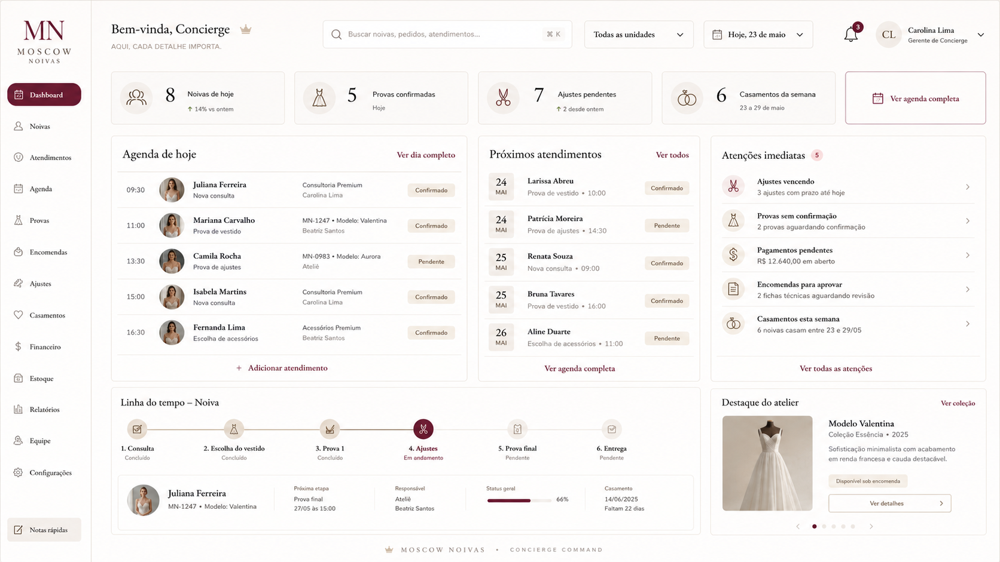

# Referência visual — Dashboard Concierge Command

Imagem de referência principal:

## Conceito da referência

Esta imagem representa a direção **Concierge Atelier** para o dashboard da Moscow Noivas.

Ela é a referência para transmitir:
- boutique premium;
- clareza operacional;
- delicadeza visual;
- organização de agenda;
- jornada da noiva;
- atenção aos ajustes;
- estética marfim, champagne e bordô;
- luxo silencioso;
- sistema com alma de marca.

## Leitura ideal da imagem

A tela não deve parecer um ERP. Ela deve parecer uma central refinada de atendimento.

O lado esquerdo funciona como moldura institucional. O topo funciona como recepção do dia. Os cards funcionam como sinais do atelier. A agenda é o centro operacional. As atenções imediatas mostram cuidado. A linha do tempo transforma a noiva em jornada. O vestido em destaque transforma estoque em acervo.

## O que preservar

- Menu lateral claro e elegante.
- Saudação humana.
- Busca central.
- Cards de indicadores com números grandes e ícones suaves.
- Agenda como elemento principal.
- Atenções imediatas em linguagem humana.
- Linha do tempo da noiva.
- Destaque do atelier com vestido.
- Paleta quente e refinada.
- Uso do bordô com intenção.

## O que melhorar na implementação real

- Garantir responsividade.
- Evitar textos pequenos demais.
- Garantir acessibilidade de contraste.
- Reduzir efeitos se prejudicarem performance.
- Separar componentes reutilizáveis.
- Usar dados reais do sistema.
- Evitar excesso de informação em telas menores.

## Como Claude deve usar esta referência

Claude deve abrir esta imagem e usá-la como direção visual, mas não copiar cegamente. A implementação precisa respeitar o código existente, os componentes do projeto e a usabilidade real.

A imagem é uma referência de atmosfera, composição e intenção. O arquivo `DESIGN.md` é a regra principal.
